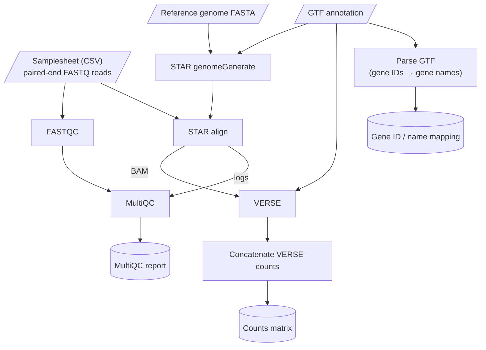

> **Note:** Sections marked **Instructions:** are scaffolding to guide you. Delete every
> instruction block (and the Example Table) once you've filled in the section, so the final
> document contains only your specifications.

# Provided Diagram

# Objective

> **Instructions:** Based on the diagram above, write a short paragraph describing the
> workflow. You can use the template from the first project as inspiration.
>
> *Delete this instruction block once you've completed this section.*

# Inputs

> **Instructions:** Describe the starting data, including:
>
> 1. How many samples?
> 2. Where and how are the samples recorded? (i.e. a samplesheet with columns named X, Y, Z, etc.)
>
> *Delete this instruction block once you've completed this section.*

# Outputs

Per Sample:

Per pipeline run:

# Pipeline Steps

> **Instructions:** Fill in one row per process in the pipeline. Derive the step list from the
> Objective and Outputs sections above. "Depends on" should name the upstream step(s) whose output
> this step consumes (used for wiring channels). Try to list only the minimum set of files needed
> for the next step. 
>
> The Example Table below is a simple worked example (not from this pipeline) showing the expected
> format: a process that downloads a genome, followed by a process that runs a script on it.
> **Delete the Example Table and this instruction block before you submit.**

## Example Table

| Step | Input type | Depends on *(sample)* |
|---|---|---|
| Download genome *(sample)* | Accession ID | - |
| Run script on genome *(sample)* | Genome FASTA | Download genome |

## Pipeline Table

| Step | Input type | Depends on |
|---|---|---|
|  |  |  |
|  |  |  |
|  |  |  |
|  |  |  |
|  |  |  |
|  |  |  |
|  |  |  |
|  |  |  |
|  |  |  |
|  |  |  |

# Development Workflow

Every process defines a `stub:` run that produces placeholder output files. All of
the stub runs should use the name from the CSV to identify outputs by their species
of origin.

# Environment and Reproducibility
For this project, we are switching over to using Docker containers through Singularity.

> **Instructions:** Look at the [Pipeline Containers](https://github.com/bu-cds-bf528/pipeline_containers)
> repository and fill in which versions of tools were used in your pipeline.
>
> *Delete this instruction block once you've completed this section.*

| Tool | Env file | Version |
|---|---|---|
|  |  |  |
|  |  |  |
|  |  |  |
|  |  |  |
|  |  |  |
|  |  |  |

# Resource Requirements

| CPUs | RAM | Label | Process |
|---|---|---|---|
|  |  |  |  |
|  |  |  |  |
|  |  |  |  |
|  |  |  |  |

# Success Criteria

The stub-run correctly produces named placeholder outputs for each row in the original CSV.

# Out of Scope

# Validation Table

For differential expression, include the model design used in DESeq2 in place of the parameter
justification.

| Step | Parameter justification | Confidence | Validation |
|---|---|---|---|
| Sequencing quality control |  |  |  |
| Genome indexing |  |  |  |
| Alignment |  |  |  |
| Quantification |  |  |  |
| Counts concatenation |  |  |  |
| GTF parsing |  |  |  |
| QC aggregation & reporting |  |  |  |
| Differential Expression | | | |

